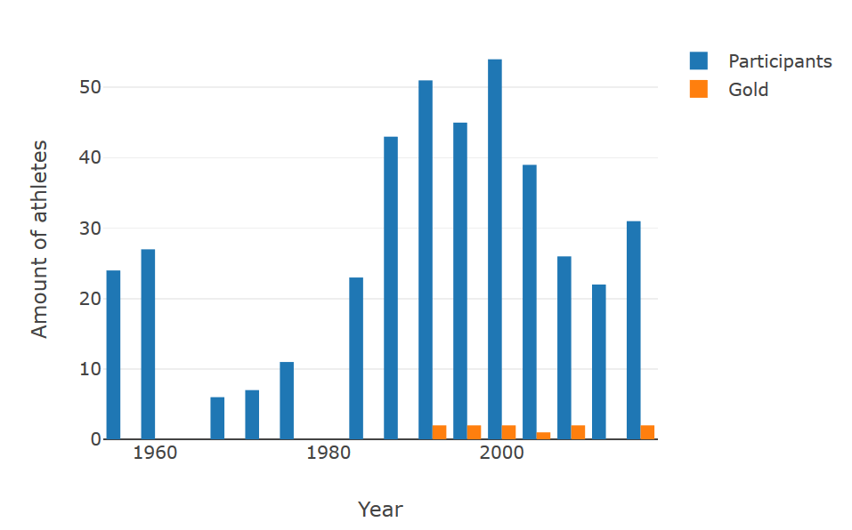
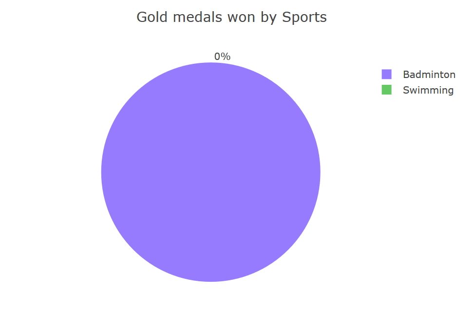
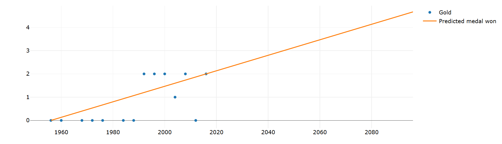
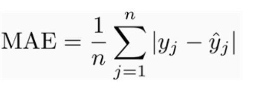

# RO-UAS

In this experiment we are going to predict the number of Indonesian athletes that will win the olympic medal
## Requirements
- Python
        Extensions:
        - Dash
        - matplotlib
        - numpy
        - pandas

For my experiment I used visual studio code for my IDE 
To install the extension type in this case dash
```
pip -install dash
```
## Other Data


These data are used to show amount of medals won throughout the year as well as in which sport they have won in, in this case only Badminton.

## Linear Regression


We chose Linear Regression because we are familiar with it. Using the first point and last point we find the gradient and plot for best fit line
Gradient=(y1 - y0)/(x1 - x0)
        =(2  - 0) / (2016 - 1956)
        = 1 / 30
        
y = m x + c
y = 1/30 x 

Since it is created by line of best fit there are some uncertainties thus we need to calculate the MAE(Mean Average Error)

We calculate using equation 




Where our result is
0.604
Since its less than 1 it's quite accurate in measuring how much medals Indonesia will
get in each year. 

## Conclusion

The data we use in predicting Indonesia's future olympic success is accurate
though there are probably more than one factor than just year in my opinion since I believe the medals won can increase exponentially. Though maybe in the next decade the estimation should be around those numbers
